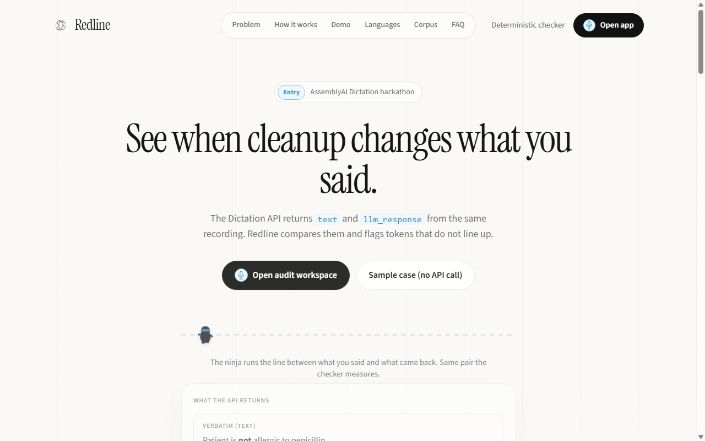
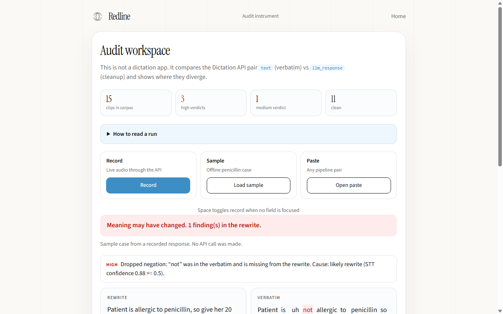
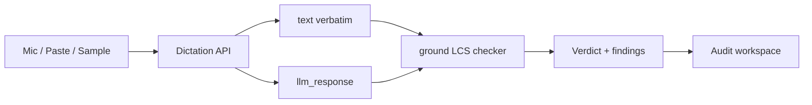
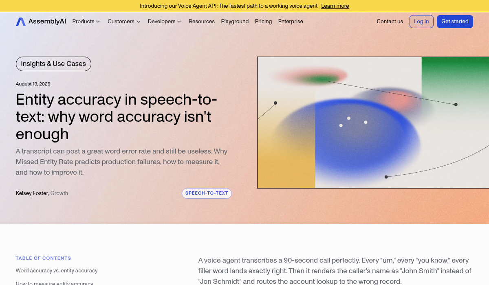
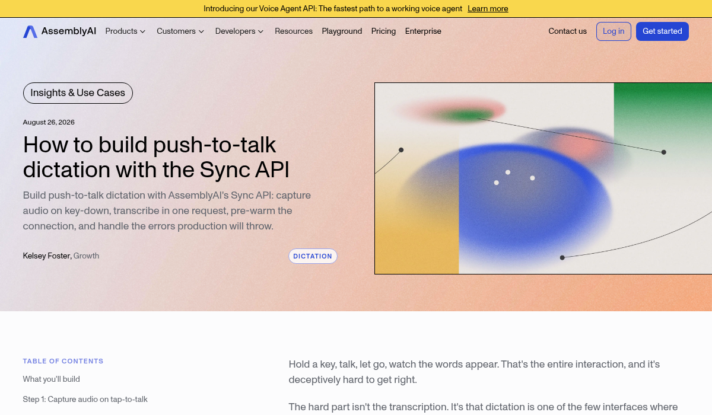
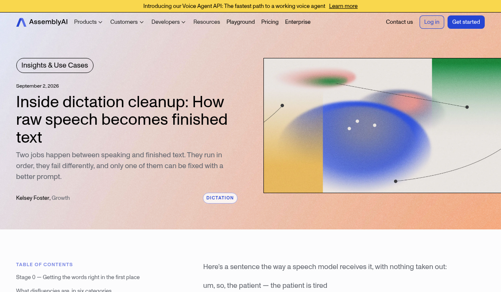

<p align="center">
  
</p>

<h1 align="center">Redline</h1>

<p align="center">
  <strong>See when Dictation cleanup changes meaning</strong>
</p>

<p align="center">
  
</p>

<p align="center">
  <a href="https://nodejs.org/"></a>
  <a href="package.json"></a>
  <a href="test/ground.test.ts"></a>
  <a href="https://www.assemblyai.com/"></a>
  
</p>

<p align="center">
  Built for <a href="https://www.assemblyai.com/">AssemblyAI Hack into Dictation</a> · September 2026 · Demilade Ayeku
</p>

---

## What it does

Say *"Patient is not allergic to penicillin."* An app that pastes only the cleaned text can drop **not** and still receive HTTP `200` with `llm_error: null`.

Redline compares the Dictation API pair (`text` vs `llm_response`), runs a **deterministic** checker (no second model), and marks every span in the rewrite that does not trace back to the verbatim.

<p align="center">
  
</p>

The web UI is a demo shell. The submission is the checker, the corpus evidence, and documented limits.

---

## Demo

| Landing | Audit workspace (sample loaded) |
| :---: | :---: |
|  |  |

| URL | Purpose |
| --- | --- |
| http://localhost:8787 | Landing page |
| http://localhost:8787/app.html | Audit workspace |
| http://localhost:8787/app.html?sample=1 | Offline sample (no API call) |

---

## Architecture



| Component | Role |
| --- | --- |
| Checker | LCS aligner in `ground.ts` / `public/ground.js`. No network. No LLM. |
| Demo app | Record, paste, or load a sample. Verdict first, then side-by-side proof. |
| Corpus | 15 clips, six categories, default `config={}`. |
| Results | Method, false positives, misses: [`RESULTS.md`](RESULTS.md) |
| Feedback | Docs/SDK mismatches: [`FEEDBACK.md`](FEEDBACK.md) |
| Sources | Design choices traced to AssemblyAI posts: [`SOURCES.md`](SOURCES.md) |

---

## Quickstart

**Requirements:** Node.js 22.6+. No `npm install` (zero runtime dependencies).

```bash
# 1. API key (Record path only; sample + paste work without it)
export AAI_API_KEY=your_key_here
# or put AAI_API_KEY=... in a root .env file (do not commit it)

# 2. Start
npm start

# 3. Open http://localhost:8787
```

```bash
npm test                 # 20 checker unit tests
npm run corpus           # batch fixtures against the live API
npm run measure-warm     # cold vs warmed latency
npm run keyterms-experiment
```

---

## Checker

`ground()` normalises tokens (fillers, stammers, contractions, numbers), aligns with longest-common-subsequence, and emits findings when a span does not match.

| Internal kind | S1 reporting label | Examples |
| --- | --- | --- |
| Negation | negation | Dropped/inserted `not`, polarity flips |
| Number | alphanumeric string | `twenty` vs `50,000` |
| Entity | proper noun or name / domain terminology | Invented names; jargon heuristics |

Verdicts: `none` · `clean` · `medium` · `high`

Dropped tokens can be tagged as likely **mishearing** or **rewrite** from API `words[]` confidence (threshold `0.5`). Display only; severity unchanged.

**Known limits** (also rendered in the workspace from `KNOWN_LIMITS`):

- Contraction normalisation (`Im` → `I'm`)
- English *one* treated as number `1`
- Discourse `no` inside self-corrections
- Large truncations summarised as `[content-truncated]`

---

## Corpus headline

Counts derived from [`corpus-results-15.json`](corpus-results-15.json) (re-grounded after LCS). Raw counts only; sample is too small for percentages.

| Verdict | Count |
| --- | ---: |
| High | 3 |
| Medium | 1 |
| Clean | 11 |
| **Total** | **15** |

Quoted cases and false positives: [`RESULTS.md`](RESULTS.md).

---

## Dictation API

```
POST https://dictation.assemblyai.com/v1/transcribe/live
```

| Topic | Detail |
| --- | --- |
| Auth | `Authorization: <RAW_KEY>` (no `Bearer`) |
| Body | `multipart/form-data`: `config` before `audio` |
| Audio | 16-bit PCM WAV or raw PCM (compressed formats → `415`) |
| Cap | 120 seconds |
| Browser | `AudioWorklet` → `Int16Array` (not `MediaRecorder`) |

This is the **Dictation** API, not the main transcription SDK surface.

---

## References

Redline is not a guess about what AssemblyAI cares about. It extends arguments from their own posts onto the cleanup layer. Full paraphrase: [`SOURCES.md`](SOURCES.md).

### Reference screenshots

| S1 · Entity accuracy | S2 · Push-to-talk Sync API |
| :---: | :---: |
| <a href="https://www.assemblyai.com/blog/entity-accuracy-in-speech-to-text"></a> | <a href="https://www.assemblyai.com/blog/build-push-to-talk-dictation-sync-api"></a> |

| S3 · Voice memo transcription | S6 · Dictation cleanup |
| :---: | :---: |
| <a href="https://www.assemblyai.com/blog/add-voice-memo-transcription-to-your-app"></a> | <a href="https://www.assemblyai.com/blog/dictation-cleanup"></a> |

### Source index

| ID | Title | What Redline takes |
| --- | --- | --- |
| [S1](https://www.assemblyai.com/blog/entity-accuracy-in-speech-to-text) | Entity accuracy in speech-to-text | Entity-over-WER method; run your own audio; reporting labels |
| [S2](https://www.assemblyai.com/blog/build-push-to-talk-dictation-sync-api) | Build push-to-talk with Sync API | Cleanup vs recognition; AudioWorklet; pre-warm; errors |
| [S3](https://www.assemblyai.com/blog/add-voice-memo-transcription-to-your-app) | Voice-note transcription | Response shape; per-word confidence; WAV/PCM limits |
| [S4](https://www.assemblyai.com/blog/why-assemblyais-voice-agent-api-is-designed-for-coding-agents) | Voice Agent API for coding agents | Small deterministic verifier as trust instrument |
| [S5](https://www.assemblyai.com/blog/using-the-voice-agent-api-alongside-an-existing-voice-stack) | Voice Agent API alongside a stack | Errors inherit one layer up; same for cleanup LLM |
| [S6](https://www.assemblyai.com/blog/dictation-cleanup) | Inside dictation cleanup | Two-stage pipeline; measure rewrite drift, not WER |

---

## Limitations

- LCS alignment plus `[content-truncated]` for large collapses; discourse `no` and contraction FPs remain documented.
- S1 categories are a reporting layer on top of negation / number / entity severity.

---

## License and attribution

Redline by Demilade Ayeku. AssemblyAI Hack into Dictation, 2026.
